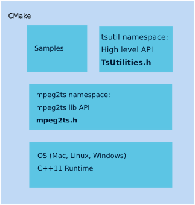
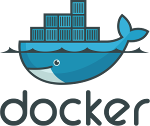
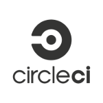

# MPEG-2 Transport Stream utility library
A fast, modern C++ SDK for all your MPEG-2 transport stream media format needs following
international specification ISO/IEC 13818-1. The standard is also called H.222 including both TS and PS.

Artifacts:
```
Win32: mpeg2ts.dll mpeg2ts.lib
Linux: libmpeg2ts.so libmpeg2ts.a
Both: mpeg2ts.h
```
Applications:
```
Win32: TestTsLib located under msvs/2015
Linux: tsparser
```

## Requirements / example usage
C++11 is the minimal requirement. The library is written as platform independent code and tested on Mac OS X, Ubuntu 16.04/18.04, Windows 10.

## SW Architecture
There are 2 sets of APIs, the core API called mpeg2ts under the same namespace and a utility API to facilitate the usage of the API for more convinient usage (namespace tsutil). These are the APIs:
* mpeg2ts.h    The core and fundamental API for all mpeg2ts usage
* TsUtilities.h High level API to simplify usage


## Settings
Edit the `settings.json` file to change log level, log file name and other properties. These are global settings for the mpeg2ts set of libraries. Log levels are:
```
VERBOSE
DEBUG
INFO
WARNING
ERROR
FATAL
NONE
```
where VERBOSE is the maximum log output as compared to NONE which generates no output. The default log output file is `mpeg2ts_log.csv` in csv style for easier use.

## Building
To simplify the crosscompile process we use CMake. Under Linux just do this:
```Bash
mkdir build
cd build/
cmake -DCMAKE_BUILD_TYPE=Debug|Release ..
make
```
You will get the following artifacts:
```Bash
libmpeg2ts.a
tsparser*
```
To also build the shared libraries you need to tell CMake to build those:
```Bash
cmake -DCMAKE_BUILD_TYPE=Debug|Release -DBUILD_SHARED_LIBS=YES ..
```
which result in `libmpeg2ts.so*`.


If you wanna speed up the build you can type `cmake --build . -- -j$(nproc)` instead of `make` in the 4th command above.

## Installation
In order to install this library you can type:
```Bash
cmake -DCMAKE_INSTALL_PREFIX=../_install ..
make -j 8
make install
```
and now you will find the installed libraries and headers in `_install` directory. Omit `CMAKE_INSTALL_PREFIX` to install in system default `/usr/local/lib`.

## Packaging
To generate a package with both debug and release build type:
```Bash
./gen_package.sh
```
This will generate a package
```Bash
mpeg2ts-0.2.1-Linux.tar.gz
```
for example containing only shared libs.

## Usage
To find this package using CMake simply use find_package:
```Bash
find_package(mpeg2ts REQUIRED)

target_link_libraries(${PROJECT_NAME} PUBLIC mpeg2ts::mpeg2ts)
```

If you want to use ts-lib installation with your project you need to set the `CMAKE_PREFIX_PATH` to where ts-lib is being installed if it wasn't installed under your system.

### Linux Make
[Deprecated] This is the traditionall way of building using GNU Make. This is left for legacy purpose and before all targets been ported to CMake. The recommended way of building this library is CMake.

## Tsparser
### How to run it
Type `make help` to see all make targets. To start runing the lib:
```
make all
./tsparser --input assets/test1.ts
```
Check help in command line (CLI):
```
./tsparser --help --input assets/test1.ts
```
Add option --write with the PES PID for writing PES packets to file.
```
./tsparser --write 2504 --input assets/bbc_one.ts
```
Just print PSI tables / PES header can be done by --pid option and the PID.
```
./tsparser --pid 258 --input assets/bbc_one.ts
```

### Docker


Some targets requires docker in order to run since you most likely will not have
all build dependencies in your native environment. To virtualize the Application
build time dependencies they have been collected inside a docker image following
docker best practises. You only need to remember to source the 
```
source docker-commands.sh
```
and you will be ready to run commands inside the docker container by:
```
docker-make unit-tests
```
for example.
If you want to run a custom bash command you can do it by:
```
docker-bash make help
```
for instance. To get an interactive bash session type:
```
docker-interactive
```

### Docker image
To just use the latest image just pull from our private registry/repository @ DockerHub:
```
docker pull heliconwave/circleci:v1
```
To build the image your self:
```
make docker-image
```

### How to test it
In order to run all unit tests just type:
```
make test
```
This will spin up a docker container with gtest/gmock and execute all tests.

## Windows
Currently only WIN32 (x86) is supported with VS2015/VC14 compiler which has a fairly large C++11 support. 
There is a VS2015 solution file under msvc/2015 for this project. Unit tests (google test) is in same solution as 
mpeg2ts solution and needs the lib to be build in static mode to access all internal classes/symbols. There is a main application
called TestTsLib that uses the dynamic mpeg2ts.dll library in the same solution. To build mpeg2ts.dll project open msvc/2015/mpegts2ts.sln and
change to dynamic project. This is the VS2015 solution file:
* mpeg2ts.sln

## Continuous integration (CI)


For CI we use CircleCI which will automatically run all unit tests after a commit either
in a branch, pull-request or integration to master. You can check the status tests in any
branch by the portal:
[CircleCI](https://circleci.com/gh/skullanbones/ts-lib)

## Static code analysis
Right now there is no online tool. Use `docker-make cppcheck` and `docker-make clang-tidy`.

## Acronyms
| Abbreviation  | Meaning                             |
|---------------|-------------------------------------|
| API           | Application Program Interface       |
| CI            | Continuous Integration              |
| DVCS          | Distributed Version Control System  |
| IEC           | International Electrotechnical Commission  |
| ISO           | International Organization for Standardization  |
| MC            | Multicast                           |
| MPEG          | Moving Picture Experts Group        |
| OSS           | Open Source Software                |
| PS            | Program Stream                      |
| SDK           | Software Development Kit            |
| SW            | Software                            |
| TS            | Transport Stream                    |
| VCS           | Version Control System              |


## Technologies / Open Source Software (OSS)
| Technology    | Version minimal requirement         |
|---------------|-------------------------------------|
| C++           | C++11                               | 
| Docker        | 17.x                                | 
| CMake         | 3.11                                |
| GNU Make      | Ubuntu 16.04                        |
| GCC           | Ubuntu 16.04 (5.4)                  |
| Python        | Python 3.x                          |
| Git           | 2.x                                 |
| Google test   | 1.8.x                               |
